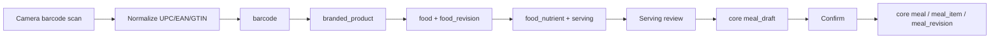
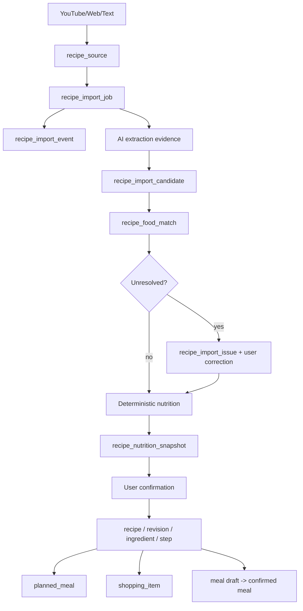
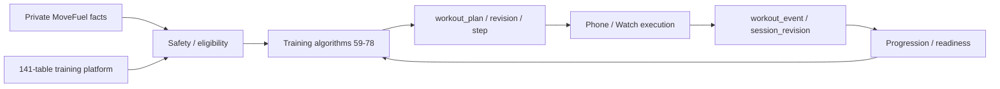

# MoveFuel Full-Product Schema Expansion

## What the 400-screen audit changes
The **81-table core is a proven baseline**, but it does not fully normalize every durable capability exposed by the 400-screen UI.

### Draft additions
- Recipe + YouTube/Web/Text import: **12**
- Meal planning: **7**
- Shopping + pantry: **5**
- Soreness/readiness: **3**
- Progress media/body observations: **2**
- Proposed private-core additions: **29**
- Baseline 81 + 29 = **~110 private core tables** if all survive reconciliation.

### Shared food/barcode catalog
A separate shared catalog proposal adds **15 tables**. It stores normalized USDA/Open Food Facts/product/barcode/reference facts, not private meal history.

## Barcode flow

## YouTube recipe flow

AI extracts candidates; **MoveFuel nutrition logic + trusted food data remain authoritative**.

## Training connection

## Count warning
Raw architecture counts can exceed 250 logical tables if you simply add 110 private core + 15 food catalog + all 141 training-platform tables. **Do not do that blindly.** The 141 training matrix contains athlete/device/governance concepts that overlap the core.

The next database task is a **deduplication/authority reconciliation**: one canonical owner for every noun, then final SQL migrations.
