# MoveFuel 81-table ERD

```mermaid
erDiagram
    meal_analysis_request ||--o{ analysis_attempt : "requestId"
    prompt_version ||--o{ analysis_attempt : "promptVersionId"
    model_configuration ||--o{ analysis_attempt : "modelConfigId"
    meal_analysis_request ||--o{ analysis_event : "requestId"
    analysis_attempt ||--o{ analysis_event : "attemptId"
    prompt_template ||--o{ prompt_version : "promptId"
    meal_analysis_request ||--o{ provider_call : "requestId"
    prompt_version ||--o{ provider_call : "promptVersionId"
    subscription ||--o{ purchase_event : "subscriptionId"
    meal_analysis_request ||--o{ usage_ledger : "requestId"
    health_connection ||--o{ health_import_cursor : "connectionId"
    device ||--o{ sync_cursor : "deviceId"
    device ||--o{ sync_operation : "deviceId"
    device ||--o{ watch_delivery : "deviceId"
    device ||--o{ watch_receipt : "deviceId"
    calendar_revision ||--o{ calendar_entry : "calendarRevisionId"
    sync_operation ||--o{ calendar_revision : "operationId"
    deletion_request ||--o{ deletion_job : "deletionRequestId"
    export_job ||--o{ export_artifact : "exportJobId"
    device ||--o{ user_session_metadata : "deviceId"
    notification ||--o{ notification_delivery : "notificationId"
    device ||--o{ notification_delivery : "deviceId"
    daily_recommendation ||--o{ action_completion : "recommendationId"
    target_revision ||--o{ daily_aggregate : "targetRevisionId"
    device ||--o{ daily_summary : "deviceId"
    nutrition_source_cache ||--o{ food_catalog_alias : "nutritionSourceId"
    meal_draft ||--o{ meal_analysis_request : "draftId"
    device ||--o{ meal_draft : "deviceId"
    meal_media ||--o{ meal_draft : "mediaId"
    meal_draft ||--o{ meal_draft_revision : "draftId"
    meal ||--o{ meal_item : "mealId"
    meal_revision ||--o{ meal_item_revision : "mealRevisionId"
    meal_draft ||--o{ meal_media : "draftId"
    meal ||--o{ meal_media : "mealId"
    meal ||--o{ meal_revision : "mealId"
    meal ||--o{ meal_tombstone : "mealId"
    daily_recommendation ||--o{ recommendation_evidence : "recommendationId"
    saved_meal ||--o{ saved_meal_item : "savedMealId"
    report_section ||--o{ report_evidence : "sectionId"
    exercise_catalog ||--o{ exercise_muscle_map : "exerciseId"
    workout_session ||--o{ muscle_load : "sessionId"
    workout_session ||--o{ workout_event : "sessionId"
    workout_plan ||--o{ workout_plan_revision : "planId"
    workout_plan_revision ||--o{ workout_plan_step : "planRevisionId"
    exercise_catalog ||--o{ workout_plan_step : "exerciseId"
    workout_plan_revision ||--o{ workout_session : "planRevisionId"
    workout_session ||--o{ workout_session_revision : "sessionId"
    workout_session ||--o{ workout_summary : "sessionId"
    meal_draft ||--o{ meal : "sourceDraftId"
    meal ||--o{ serving_prior_observation : "sourceMealId"
```

## Domain counts
- **ai_provider: 6**
- **billing_usage: 5**
- **device_health_sync: 11**
- **foundation_ops: 13**
- **identity_profile: 9**
- **notifications: 2**
- **nutrition: 21**
- **progress_reporting: 4**
- **training: 10**
