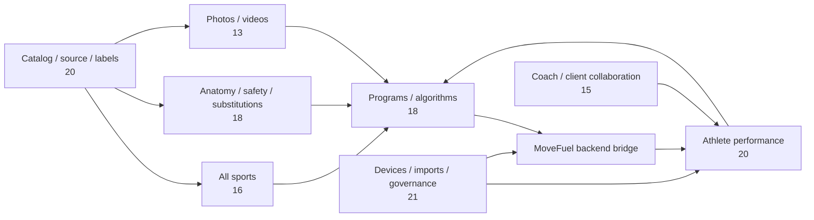

# MoveFuel Training Platform — 141-Table Connection Map

This matrix is a separate training knowledge/evidence/platform design. It connects through the MoveFuel backend and must not become a second private-user authority.

## Domain counts
- **Catalog, source & labels: 20 tables**
- **All sports: 16 tables**
- **Anatomy, safety & substitutions: 18 tables**
- **Photos & videos: 13 tables**
- **Programs & algorithms: 18 tables**
- **Athlete performance: 20 tables**
- **Coach & client collaboration: 15 tables**
- **Devices, imports & governance: 21 tables**

## High-level connection graph

## Reconciliation rule

- **85 tables** in Catalog + Sports + Anatomy/Safety + Media + Programs/Algorithms are mostly reusable shared knowledge/evidence infrastructure.
- **20 Athlete Performance tables** overlap private MoveFuel workout/profile/health state; map them through the backend instead of duplicating canonical user truth.
- **21 Devices/Imports/Governance tables** overlap core device, consent, sync, import and audit resources; reconcile before deployment.
- **15 Coach/Client tables** are future collaboration scope and should not block the consumer app.

## Full inventory

### Catalog, source & labels

- `catalog_release`
- `source_provider`
- `source_dataset`
- `source_record`
- `source_record_version`
- `source_license`
- `source_license_evidence`
- `exercise`
- `exercise_revision`
- `exercise_alias`
- `exercise_instruction`
- `exercise_instruction_step`
- `exercise_taxonomy_map`
- `exercise_equipment_map`
- `exercise_muscle_map`
- `exercise_movement_map`
- `exercise_environment_map`
- `exercise_sport_map`
- `exercise_relation`
- `catalog_review_state`

### All sports

- `sport`
- `sport_discipline`
- `sport_event`
- `sport_position`
- `sport_skill`
- `sport_drill`
- `sport_drill_revision`
- `sport_drill_step`
- `sport_metric_definition`
- `sport_metric_unit`
- `sport_test_protocol`
- `sport_test_step`
- `sport_equipment_rule`
- `sport_environment_rule`
- `sport_season_rule`
- `sport_taxonomy_map`

### Anatomy, safety & substitutions

- `anatomy_region`
- `muscle_group`
- `muscle`
- `joint`
- `movement_pattern`
- `movement_plane`
- `movement_constraint`
- `condition`
- `contraindication`
- `condition_exercise_rule`
- `safety_screen_definition`
- `safety_screen_rule`
- `exercise_safety_rule`
- `progression_rule`
- `regression_rule`
- `substitution_group`
- `substitution_rule`
- `load_model`

### Photos & videos

- `media_asset`
- `media_asset_revision`
- `media_variant`
- `media_license`
- `media_rights_evidence`
- `media_source_link`
- `media_ingestion_job`
- `media_transcode_job`
- `media_quality_review`
- `media_attribution`
- `media_access_policy`
- `media_deletion_request`
- `media_delivery_audit`

### Programs & algorithms

- `training_goal`
- `program_template`
- `template_revision`
- `template_block`
- `template_session`
- `template_session_item`
- `workout_plan`
- `plan_revision`
- `planned_session`
- `planned_session_item`
- `program_phase`
- `progression_policy`
- `deload_policy`
- `session_requirement`
- `algorithm_release`
- `algorithm_rule_set`
- `algorithm_run`
- `algorithm_decision`

### Athlete performance

- `training_account`
- `athlete_profile`
- `athlete_sport_profile`
- `athlete_goal`
- `athlete_equipment`
- `athlete_limitation`
- `athlete_availability`
- `readiness_checkin`
- `workout_session`
- `workout_session_revision`
- `workout_event`
- `performed_exercise`
- `performed_set`
- `set_metric`
- `rest_interval`
- `session_metric`
- `workout_summary`
- `personal_record`
- `sport_activity`
- `sport_lap_split`

### Coach & client collaboration

- `coach_profile`
- `coach_client_relationship`
- `coaching_invitation`
- `coach_note`
- `coach_note_revision`
- `comment_thread`
- `comment`
- `comment_attachment`
- `coaching_task`
- `coaching_task_update`
- `checkin_request`
- `progress_review`
- `message_thread`
- `message`
- `message_attachment`

### Devices, imports & governance

- `device`
- `device_authorization`
- `device_sync_cursor`
- `health_observation`
- `health_observation_source`
- `body_measurement`
- `fitness_baseline`
- `import_run`
- `import_item`
- `import_error`
- `export_run`
- `export_item`
- `audit_event`
- `access_grant`
- `consent_record`
- `retention_policy`
- `deletion_request`
- `review_queue`
- `review_decision`
- `notification`
- `notification_delivery`
